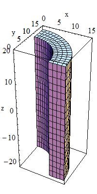
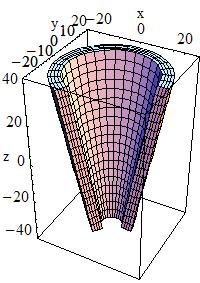
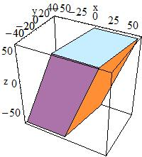

# Solids Cheat-Sheet for musrSim

This note is a compact, self-contained reference for the solids available through

```text
/musr/command construct
```

Units:
- **lengths in mm**
- **angles in degrees**

General placement syntax:

```text
/musr/command construct <solid> <name> <shape parameters...> <material> x y z <mother> <rotation> <sensitive> <id>
```

For the top volume:
- the world must be named `World`
- its mother must be `no_logical_volume`

For daughter volumes:
- the mother name is typically `log_<MotherName>`

---

# 1. Standard Geant4 solids

These follow the usual Geant4 parameter meanings.

## 1. `box`


```text
box hx hy hz
```

Parameters:
- `hx`, `hy`, `hz` = half-lengths along `x`, `y`, `z`

Minimal example:

```text
/musr/command construct box World 200 200 200 G4_AIR 0 0 0 no_logical_volume norot dead -1
/musr/command construct box Box1 50 30 20 G4_Al 0 0 0 log_World norot dead 1
```

---

## 2. `tubs` (cylinder)



```text
tubs rMin rMax hz phiStart phiDelta
```

Parameters:
- `rMin` = inner radius
- `rMax` = outer radius
- `hz` = half-length along `z`
- `phiStart` = start azimuth angle
- `phiDelta` = azimuth span

Minimal example:

```text
/musr/command construct box World 200 200 200 G4_AIR 0 0 0 no_logical_volume norot dead -1
/musr/command construct tubs Cyl1 0 50 50 0 360 G4_Al 0 0 0 log_World norot dead 1
```

---

## 3. `cons` (truncated cone)



```text
cons rMin1 rMax1 rMin2 rMax2 hz phiStart phiDelta
```

Parameters:
- `rMin1`, `rMax1` = inner/outer radii at `z = -hz`
- `rMin2`, `rMax2` = inner/outer radii at `z = +hz`
- `hz` = half-length along `z`
- `phiStart`, `phiDelta` = azimuth parameters

Minimal example:

```text
/musr/command construct box World 250 250 250 G4_AIR 0 0 0 no_logical_volume norot dead -1
/musr/command construct cons Cone1 0 20 0 40 50 0 360 G4_Al 0 0 0 log_World norot dead 1
```

---

## 4. `sphere`


```text
sphere rMin rMax phiStart phiDelta thetaStart thetaDelta
```

Parameters:
- `rMin`, `rMax` = inner/outer radius
- `phiStart`, `phiDelta` = azimuth range
- `thetaStart`, `thetaDelta` = polar range

Minimal example:

```text
/musr/command construct box World 250 250 250 G4_AIR 0 0 0 no_logical_volume norot dead -1
/musr/command construct sphere S1 0 50 0 360 0 180 G4_Al 0 0 0 log_World norot dead 1
```

---

## 5. `trd` (trapezoid)


```text
trd hx1 hx2 hy1 hy2 hz
```

Parameters:
- `hx1`, `hx2` = half-lengths in `x` at the two `z` faces
- `hy1`, `hy2` = half-lengths in `y` at the two `z` faces
- `hz` = half-length in `z`

Minimal example:

```text
/musr/command construct box World 250 250 250 G4_AIR 0 0 0 no_logical_volume norot dead -1
/musr/command construct trd T1 40 20 30 15 10 G4_Al 0 0 0 log_World norot dead 1
```

---

## 6. `para` (parallelepiped)



```text
para hx hy hz alpha theta phi
```

Parameters:
- `hx`, `hy`, `hz` = half-lengths
- `alpha`, `theta`, `phi` = skew/tilt angles

Minimal example:

```text
/musr/command construct box World 250 250 250 G4_AIR 0 0 0 no_logical_volume norot dead -1
/musr/command construct para P1 30 20 10 20 30 45 G4_Al 0 0 0 log_World norot dead 1
```

---

## 7. `polyconeA`


```text
polyconeA phiStart phiTotal numZPlanes zPlane[] rInner[] rOuter[]
```

Parameters:
- `phiStart`, `phiTotal` = azimuth range
- `numZPlanes` = number of planes
- `zPlane[]` = array of `z` positions
- `rInner[]` = array of inner radii
- `rOuter[]` = array of outer radii

Arrays must be defined first:

```text
/musr/command arrayDef zA    4 -50 0 50 100
/musr/command arrayDef rinA  4   0 0  0   0
/musr/command arrayDef routA 4  10 30 20 40
```

Minimal example:

```text
/musr/command construct box World 300 300 300 G4_AIR 0 0 0 no_logical_volume norot dead -1
/musr/command arrayDef zA    4 -50 0 50 100
/musr/command arrayDef rinA  4   0 0  0   0
/musr/command arrayDef routA 4  10 30 20 40
/musr/command construct polyconeA PolyA 0 360 4 zA rinA routA G4_Al 0 0 0 log_World norot dead 1
```

---

## 8. `polyconeB`


```text
polyconeB phiStart phiTotal numRZ r[] z[]
```

Parameters:
- `phiStart`, `phiTotal` = azimuth range
- `numRZ` = number of points
- `r[]`, `z[]` = radial and axial arrays

Arrays must be defined first.

Minimal example:

```text
/musr/command construct box World 300 300 300 G4_AIR 0 0 0 no_logical_volume norot dead -1
/musr/command arrayDef rB 4 10 30 20 40
/musr/command arrayDef zB 4 -50 0 50 100
/musr/command construct polyconeB PolyB 0 360 4 rB zB G4_Cu 0 0 0 log_World norot dead 1
```

Note:
- In practice, `polyconeA` is usually clearer and easier to debug than `polyconeB`.

---

# 2. musrSim-specific solids

These are custom musrSim shapes. Some are well behaved, some are legacy/instrument-specific, and some parameters appear ineffective in tested builds.

## 9. `uprofile`

```text
uprofile x1 x2 x3 x4
```

Meaning:
- outer dimensions of the U-profile are given by `x1`, `x2`, `x3`
- `x4` = wall thickness
- the solid is a U-shaped bar, centered like its outer bounding box

Minimal example:

```text
/musr/command construct box World 300 300 300 G4_AIR 0 0 0 no_logical_volume norot dead -1
/musr/command construct uprofile U1 60 40 200 5 G4_Al 0 0 0 log_World norot dead 1
```

Notes:
- In wireframe the U-channel is usually clear.
- In surface mode, OpenGL may show misleading faces for this solid.
- Use caution before trusting visualization alone.

---

## 10. `alcSupportPlate`

```text
alcSupportPlate x1 x2 x3 x4
```

Empirical meaning in tested musrSim build:
- `x1` = width of the large plate
- `x2` = vertical offset between large plate and small block
- `x3`, `x4` = no visible effect observed in tested geometry/visualization

Minimal example:

```text
/musr/command construct box World 300 300 300 G4_AIR 0 0 0 no_logical_volume norot dead -1
/musr/command construct alcSupportPlate ASP1 40 5 20 10 G4_Al 0 0 0 log_World norot dead 1
```

Notes:
- This appears to be a legacy instrument-specific solid.
- In the tested version, it behaves as if only `x1` and `x2` are active.

---

## 11. `tubsbox`

```text
tubsbox x1 x2 x3 x4 x5
```

Meaning:
- custom solid described as a **tube with a rectangular hole along its axis**
- `x1` = box half-width (documented)
- `x2..x5` define the tube part, but exact practical mapping was not resolved reliably from macro testing alone

Minimal example:

```text
/musr/command construct box World 300 300 300 G4_AIR 0 0 0 no_logical_volume norot dead -1
/musr/command construct tubsbox TB1 10 20 30 40 360 G4_Al 0 0 0 log_World norot dead 1
```

Notes:
- Avoid zero values until the parameter meaning is verified in your build.
- This solid wraps an internal `G4Tubs`; invalid radius combinations can crash initialization.

---

## 12. `tubsboxsegm`

```text
tubsboxsegm <orientation> x1 x2 x3 x4 x5
```

Meaning:
- solid built as an **intersection of a tube and a shifted box**
- `orientation ∈ {U, D, L, R}`
  - `U` = up / +Y side
  - `D` = down / -Y side
  - `L` = left / +X side
  - `R` = right / -X side
- `x1` = offset parameter controlling box displacement
- `x2` = outer tube radius
- `x3` = half-length along `z`
- `x4` = no clear visible effect in tested build
- `x5` = angular extent of the tube

Validity condition:
- for `U`, a safe condition is `x1 < x2`
- otherwise the shifted box may no longer intersect the tube, producing a degenerate solid

Minimal example:

```text
/musr/command construct box World 300 300 300 G4_AIR 0 0 0 no_logical_volume norot dead -1
/musr/command construct tubsboxsegm TBS1 U 5 10 40 30 360 G4_Al 0 0 0 log_World norot dead 1
```

Notes:
- This one is sensitive to parameter combinations.
- If the box and tube do not overlap, Geant4 reports a bad bounding box for the intersection solid.

---

## 13. `trd90y`

```text
trd90y x1 x2 x3 x4 x5
```

Meaning:
- same geometric content as a trapezoid (`G4Trd`)
- musrSim applies an **extra built-in 90° rotation about the local y-axis**
- `x1`, `x2` = half-lengths of opposite faces in one transverse direction
- `x3`, `x4` = half-lengths of opposite faces in the other transverse direction
- `x5` = half-length along thickness axis

Minimal example:

```text
/musr/command rotation rot0 0 0 0
/musr/command construct box World 300 300 300 G4_AIR 0 0 0 no_logical_volume norot dead -1
/musr/command construct trd90y T1 40 20 30 15 10 G4_Al 0 0 0 log_World rot0 dead 1
```

Important note:
- In the tested musrSim build, using `norot` with `trd90y` caused a segmentation fault.
- Workaround: define an explicit identity rotation (`rot0`) and use that instead of `norot`.

---

## 14. `cylpart`

```text
cylpart x1 x2 x3 x4
```

Meaning from implementation:
- built from a **half-cylinder** with a **subtracted box**
- `x1` = parsed, but appears unused in the tested implementation
- `x2` = outer radius of the half-cylinder
- `x3` = half-length along `z`
- `x4` = cut-control parameter; the subtracted box uses half-height `(x2 - x4)`

Validity condition:
- require `x4 < x2`

Minimal example:

```text
/musr/command construct box World 300 300 300 G4_AIR 0 0 0 no_logical_volume norot dead -1
/musr/command construct cylpart CP1 0 20 40 8 G4_Al 0 0 0 log_World norot dead 1
```

---

## 15. `GPDcollimator`

```text
GPDcollimator x1 x2 x3 x4 x5 x6 x7 x8 x9 x10 x11 x12
```

Meaning:
- legacy hard-coded solid introduced for the GPD copper collimator
- documented groups:
  - `x1, x2, x3` = box half-dimensions
  - `x4, x5, x6, x7` = tube-defining parameters
  - `x8, x9, x10` = offsets between tube and box centers
- `x11`, `x12` are additional shape parameters used by the internal implementation

Minimal known working example:

```text
/musr/command rotation rot0 0 0 0
/musr/command construct box World 300 300 300 G4_AIR 0 0 0 no_logical_volume norot dead -1
/musr/command construct GPDcollimator GPD1 40 15 60 59 60.01 0 360 0 59 0 2.5 6 G4_Cu 0 0 0 log_World rot0 dead 1
```

Notes:
- This is best treated as an instrument-specific legacy solid, not a general-purpose primitive.
- Use known-good examples rather than free exploration.

---

# 3. Practical notes

## Common failure modes

- forgetting that many dimensions are **half-lengths**
- using invalid radius combinations (`rMin > rMax`, or zero/negative outer radius)
- using custom solids with parameter combinations that produce degenerate intersections
- trusting OpenGL surface rendering too much for complex subtraction/intersection solids

## Recommended debugging strategy

For unfamiliar or custom solids:
1. start from a minimal working example
2. change only **one parameter at a time**
3. inspect in both:
   - surface mode
   - wireframe mode
4. if needed, run:

```text
/geometry/test/run
```

## Safe mental grouping

- **Primitive Geant4 solids**: `box`, `tubs`, `cons`, `sphere`, `trd`, `para`
- **Profile-based solids**: `polyconeA`, `polyconeB`
- **musrSim custom / legacy solids**: `uprofile`, `alcSupportPlate`, `tubsbox`, `tubsboxsegm`, `trd90y`, `cylpart`, `GPDcollimator`

For serious detector work, standard Geant4 solids are usually safer and easier to validate than musrSim-specific legacy solids.
